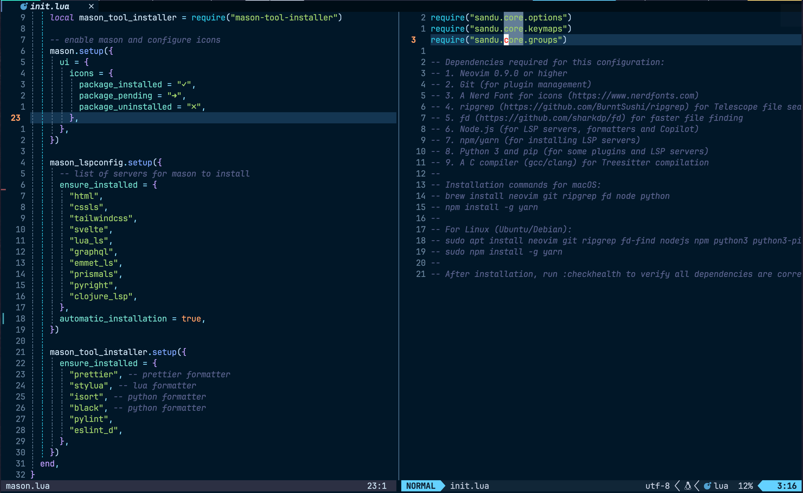

# Sandu's Neovim Configuration

A modern Neovim configuration focused on productivity with excellent treesitter integration, LSP support, and a carefully selected set of plugins.

## Features

- **Modular Architecture**: Well-organized configuration split into core settings and plugins
- **Lazy Loading**: Uses lazy.nvim for efficient plugin management and faster startup
- **LSP Integration**: Preconfigured LSP with Mason for easy language server management
- **Treesitter Power**: Enhanced syntax highlighting and advanced text objects
- **Git Integration**: Smooth git workflow with Gitsigns and LazyGit
- **Formatting & Linting**: Automatic code formatting via Conform.nvim
- **Productivity Tools**: Mini.nvim modules for quick text manipulation
- **Beautiful UI**: Customized interface with statusline, bufferline and modern colorscheme

### Screenshots

<div align="center">
  <div style="display: flex; flex-wrap: wrap; gap: 10px; justify-content: center">
    
    
    
    
    
  </div>
</div>

## Installation

1. Clone this repository to your Neovim configuration directory:

```bash
git clone git@github.com:sandudorogan/nvim-config.git ~/.config/nvim
```

2. Install dependencies as instructed in the [init.lua](./lua/sandu/core/init.lua) file.

3. Start Neovim. Plugins will be automatically installed on first launch.

## Structure

- `init.lua`: Main entry point for Neovim
- `lua/sandu/core/`: Core Neovim settings
  - `options.lua`: Neovim options
  - `keymaps.lua`: Key mappings
  - `groups.lua`: Autocommand groups
- `lua/sandu/plugins/`: Plugin configurations
- `after/queries/`: Custom treesitter queries

## Key Plugins

- **LSP**: Complete Language Server Protocol support
- **Treesitter**: Advanced syntax highlighting and text objects
- **Telescope**: Fuzzy finder for files, buffers, and more
- **Mini.nvim**: Collection of independent Lua modules:
  - Operators: Enhanced text operations
  - Pairs: Auto-pairing of brackets
  - Surround: Quick manipulation of surrounding characters
  - AI: Extended text objects
- **Conform.nvim**: Formatting with support for multiple languages
- **Copilot**: AI-powered code completion

## Text Objects

This configuration includes enhanced text objects for:

- Assignments (=)
- Object properties (:)
- Parameters/arguments
- Conditionals
- Loops
- Function calls
- Method/function definitions
- Classes

## Key Mappings

- `<leader>mp`: Format file or selected range
- `]m/[m`: Navigate to next/previous function
- `]c/[c`: Navigate to next/previous class
- `;/,`: Repeat/reverse last Treesitter movement
- Many more discoverable via WhichKey (`<leader>`)

## Language Support

Preconfigured formatting for:

- JavaScript/TypeScript
- React
- HTML/CSS
- Lua
- Python
- Clojure
- And more

## Customization

The configuration is designed to be easily customizable. Modify files in the `lua/sandu/core/` directory for basic settings, or add/modify plugin configurations in `lua/sandu/plugins/`.
