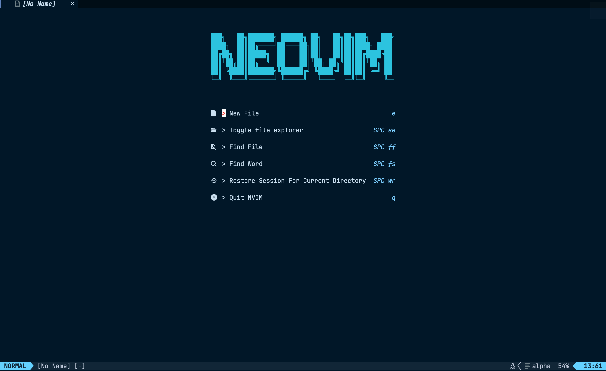
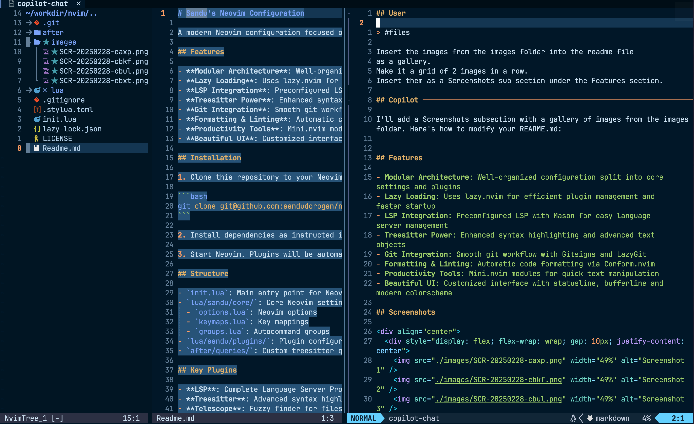
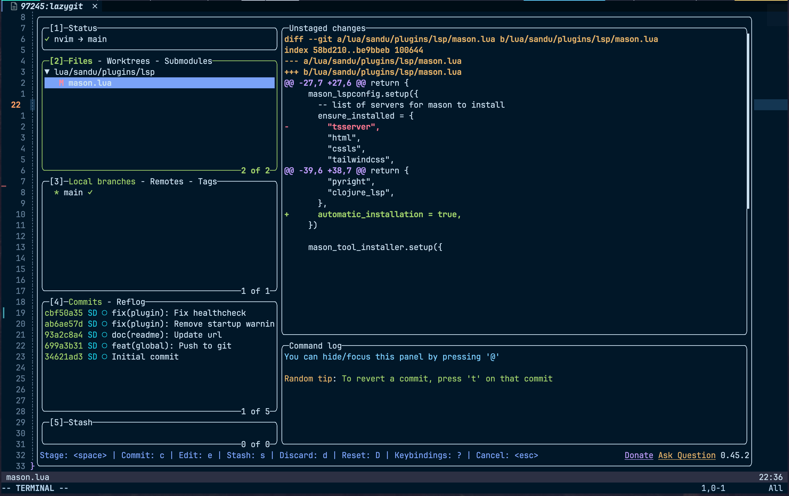
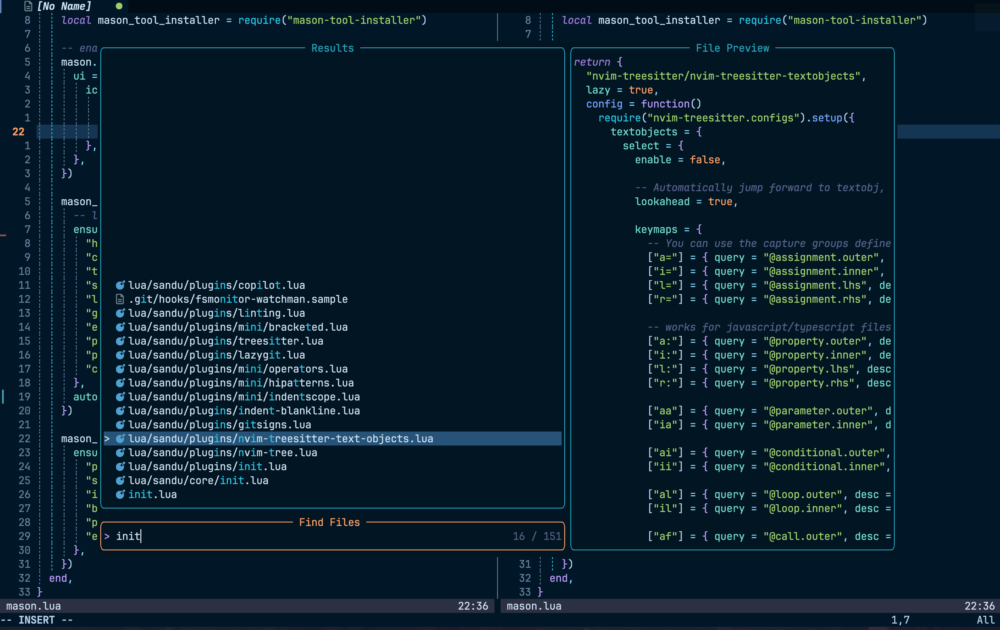

# ✨ Sandu's Neovim Setup ✨

Welcome! I'm glad you've found your way here. This Neovim configuration is something I've put together to make coding feel effortless and enjoyable. It blends speed, functionality, and a clean aesthetic to keep you productive without distractions. If you like your coding environment fast, smart, and stylish, this setup might just become your favorite.

## 🚀 What You'll Find

- 🧩 **Clear and Simple Organization** - Modular setup that's easy to adjust
- ⚡ **Instant Performance** - Plugins that load on-demand, keeping things swift
- 🔍 **Intelligent Code Assistance** - Language Server Protocol (LSP) for deep, contextual code understanding
- 🌲 **Enhanced Syntax Highlighting** - Treesitter for clear, accurate visuals even in complex files
- 🐙 **Integrated Git Workflow** - Manage your code effortlessly within the editor
- ✨ **Automatic Code Formatting** - Keeps your code clean automatically, letting you focus on coding
- 🛠️ **Efficient Text Editing** - Handy tools to make text manipulation smooth and intuitive
- 🎨 **Visual Comfort** - A thoughtfully designed UI that's pleasant for long coding sessions

## 📸 See It in Action

Take a quick peek at how it looks:

<div align="center">
  <div style="display: flex; flex-wrap: wrap; gap: 10px; justify-content: center">
    
    
    
    
  </div>
</div>

> _Function meets aesthetics for the ultimate coding experience!_

## Getting Started

1. Clone this repo into your Neovim configuration folder:

```bash
git clone git@github.com:sandudorogan/nvim-config.git ~/.config/nvim
```

2. Follow dependency instructions listed in [init.lua](./lua/sandu/core/init.lua).

3. Launch Neovim—plugins will install automatically on your first run.

## Configuration Structure

- `init.lua`: The main configuration entry point
- `lua/sandu/core/`: Core settings like options, key mappings, and autocommands
  - `options.lua`: Customize Neovim settings
  - `keymaps.lua`: Set your preferred shortcuts
  - `groups.lua`: Organize automated commands
- `lua/sandu/plugins/`: Plugin-specific configurations
- `after/queries/`: Custom queries for Treesitter

## 💎 Plugin Highlights

These plugins really elevate the experience:

- 🧠 **LSP** - Smart, contextual coding assistance
- 🌳 **Treesitter** - Accurate and advanced syntax highlighting
- 🔭 **Telescope** - Lightning-fast search capabilities
- 🤖 **Copilot & CodeCompanion** - AI-powered coding support
- ✨ **Conform.nvim** - Effortless code formatting across many languages
- 🧰 **Mini.nvim Toolkit**:
  - Powerful text-editing features
  - Intelligent bracket auto-pairing
  - Quick text wrapping and surrounding
  - AI-driven text manipulation

## ✏️ Make It Yours

This setup is intended as your starting point—feel free to personalize it:

- Adjust core settings in `lua/sandu/core/`
- Add or remove plugins in `lua/sandu/plugins/`
- Customize the visual theme to fit your style

The best coding environment feels natural, like an extension of your own thought process. Enjoy creating yours! 💻✨
